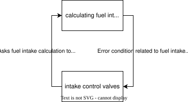
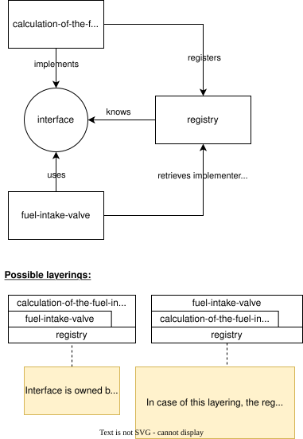

#+TITLE: Fundamental Software Architecture
#+AUTHOR: Marvin Dostal
#+LANGUAGE: en_us

* Goal

This document aims to communicate the fundamentals of software architecture in a succinct and easy to understand way.

* (Optional) Introduction

If one is already (very) experienced in the field of software, this document might seem unnecessary or obvious.
However, I do think it is important to try to express what I have learned over the years.
I do not claim that this is the one valid way to look at software architecture.
However, I do feel it is a universal and hopefully useful point of view.

The topic of software architecture often-times feels impossible to put into words:
making it hard to write down the fundamentals.
Long books exist that about the topic of software archiecture.
In my experience, though, they are trying to cover the topic with too much detail, e.g., describing and evaluating every edge case in detail.
I find the content to be too difficult to keep in the active memory.

This documents goal is to describe broad concepts that are sufficient to understand how "good" software is usually structured.
"Good" in the context of this document is concerned with /understandability/ and /maintainability/.

** Why "performance" is omitted

While performance is an important part of "good" software, software performance is usually already good enough when keeping things simple.
It can be true that a chosen architecture, which follows the details described here, can have horrible performance.
However, in my experience, performance issues can usually be solved by looking at the specific locations that slow everything down and optimizing them.

The  main principle to keep in mind for good performance is to "process data in batches". This is beneficial for:
- sharing computation results
  - as opposed to calculating the same thing over and over (for a slightly different context)
- hardware access can be combined
  - as opposed to doing every hardware access sequentially
- if the data to be processed and the result memory are coherent memory blocks, CPU caches work efficiently
  - as opposed to data and results being scattered all over the memory requiring the CPU to stop and wait for fetching the data into the cache
- parallelization can be introduced more easily to work on multiple elements of the batch in parallel
  - as opposed to being forced doing everything sequentially
- etc.

Oftentimes the various performance improvements introduce additional complexity into the software architecture and code.
This complexity can often be avoided by completely rearchitecting the software.
However, in practice the trade-off of (usually slightly) more complicated code is better than throwing everything away and constantly starting anew.

* Fundamental Software Architecture

** Architectural layering and organization

*** Responsibilities

When looking at a software system, it has responsibilities, i.e., things it wants to accomplish.
Those responsibilities can be thought of in high or low abstraction;
e.g.,
1. start the rocket (high abstraction),
2. flip the bit that starts ignition (low abstraction).

It is usually good if a responsibility is implemented by a tight set of source code;
e.g.,
- files that live in the same folder,
- code that is contained in a namespace,
- code that is contained in a class,
- etc.

The art of architecting is to identify a responsiblity and decide how to model it in the software.
If a responsibility that has low abstraction is implemented in the software using high abstraction code concepts, the result is that code can appear unnecessarily fragmented, which will make the code hard to understand.
For example, if the "flip that bit that starts ignition" (low abstraction) is implemented with the help of various classes in a namespace implementing a function (high abstraction),
the resulting code will be unnecessarily complicated to understand!

The architect should additionally take into considerations that requirements can change, or new requirements can come into existence:
therefore - usually - accept that the responsibilites might increase or change.
While the written code can usually never be perfectly prepared for requirement changes,
having a nice (nice = responsibilites are implemented by a tight set of source code) structuring of the code should help with being able to identify a sensible location for the implementation of additional responsiblities.
The implementation of the additional/changed requirement might need to touch a few places; if this is the case, refactoring to keep responsibilites close might make sense.
Often times a set of responsibilities are intertwined: it is often effectively impossible to have every responsiblity closely together.
In this caes, the decision of which responsibility will be implemented scattered (i.e., not closely together),
while keeping the other responsibilities together, is an important task of architecting.

(Fictional) example for responsibility to code abstraction:
- /Responsiblity/ :: /code abstraction/
- start the rocket :: various programs that all work together
- control the boosters :: a program
- real-time framework for allowing to work down tasks :: a libary with extension points that allows other code to use it
- control the fuel intake :: a high-level namespace with various folders and source code files within
- decide how much power output is needed :: a folder with various files that live in a namespace containing various classes
- decide how much fuel and the exact mixture is needed for the current conditions :: maybe a mix of structs for inputs, and a bunch of functions (could also be modelled as a class)
- control the valves :: a function that takes care of talking with the hardware
- checking whether the hardware access was working :: an if condition that will trigger corresponding code
- doing the hardware access to move the valve :: assigning a value to a (memory-mapped) variable

*** Layering

In addition to architecting code based on responsibilities, the stategy of explicitly layering various code / libraries / programs is extremely popular.
The reason for why software can be viewed in terms of layers (as opposed to arbitrary directed graphs) is that a fundamental rule is to keep the "uses" dependencies acyclic.
Because of this acyclicity, software can be described as a tree, or as layers on top of each other.

I.e., code must never depend on code, which in turn is depending on it.
An example for a cyclic dependency would be: the calculation-of-the-fuel-intake is calling the code to control the fuel-intake-valves if it senses that something is not alright,
while the code controlling the fuel-intake-valve is calling the calculation-of-the-fuel to control its valves.

Code that has cyclic dependencies on each other is hard to understand!
In this example one can wonder what happens if the two implementations disagree on how the valves should be set?
Who will have the last word controlling the valves?

To prevent cyclic dependencies it is necessary to decide who will depend on whom:
1. The calculation-of-the-fuel-intake can depend on the fuel-intake-valve.
   
   E.g., the calculation-of-the-fuel-intake will call into the fuel-intake-valve control and pass along its values with a way to communicate extreme situations.
   
   However, this does not really "feel" like a natural way; the calculation-of-the-fuel-intake should probably not be responsible for triggering when exactly the valves should change.
   
   An alternative implementation would be that the fuel intake calculation will encapsulate itself into a callable object.
   The interface of the callable object would be known to the fuel-intake-valve.
   It is important that this interface is not "owned" by the calculation-of-the-fuel-intake.
   The callable object implementing this interface could then be registered with the fuel-intake-valve.
   The fuel-intake-valve control would then be able to request a calculation-of-the-fuel-intake whenever it wants.

   The alternative implementation is an example for "Dependency Inversion"; further below a dedicated section for describes this concept in more detail.
2. The fuel-intake-valve control can depend on calculation-of-the-fuel-intake.
   E.g., thee fuel-intake-valve control will call into the calculation-of-the-fuel-intake such that it can decide how to control the valves.

Exactly how the two systems interact, i.e., interface, can be modelled/designed in various ways.
Note that the interface can either be defined and owned by either system, or even be an externally defined.
Because we want to avoid cyclic dependencies, it is not allowed for interfaces to be owned by both interacting systems:
If both systems would own the interfaces that are used for them to interact with each other, both systems would depend on each other!

The interface to be used depends on how the two systems want/need to interact.
In this context the form of the interface could be:
- C(++)-ABI via a symbol name :: that is a linker will connect objects; directly calling the function.
  In the source code this would mean that the caller directly calls the implementation.
- Providing function pointers :: e.g., via structs that are filled out and passed along, or virtual function table that usually underly the various "interface" concepts that exist in programming languages.
- Writing / reading a file :: the format and location of the files involed needs to be well defined.
- Calling a program :: stdout and stdin can be used to communicate information and trigger each other.
- Making an http request or providing an http server :: other than http various other protocols exist that can be used for socket based communication.
  The sockets can either transport the data between processes running on the same computer, or between processes running on different computers.
  (In theory also different threads could communicate via a socket; however, threads sharing a process have more efficient ways to communicate.)
- Write / read a global variable in the process :: all the running code within the code can see the global variables.
- etc. :: there is an almost unlimited way of thinking of possible interfaces that can be used by code to communicate.
  More examples can also be found in "Appendix A Interfaces" below.

"Architecting code" means deciding how to layer software and/or code and deciding on the interface design.
Note that the choice of layering can influence the interface design and vice-versa.

** Dependency inversion

A conceptually lower level commonly wants to have access to and use the upper layer.
To prevent cyclic dependencies, it is now necessary to use dependency inversion:
if the lower level needs to implement an interface for custom code execution, the interface needs to owned by the upper layer.

For the upper layer to find implemented hooks, manual registration (dependency injection) can be implemented, however, frameworks providing more automatic dependency injection are very popular.
The dependency injection frameworks allow querying for implementations of a specific interface.

Because dependency inversion is very popular of allowing lower layers to provide custom logic, software systems can often feel like they basically only consist out of hooks calling other hooks that call other hooks etc.
A good practice to keep an overview a hook should have a well defined responsibility that is neither too narrow (which would require even more hooks) nor too wide (which would require the implementer to do a lot of unrelated things).
Note that the implementation might expose a hook of its own; for example to allow further specialization by other code using it.

*** Example

Many frameworks provide a way of dependency injection.
One such group of frameworks are component frameworks:
these frameworks generally allow the registering of services implementing interfaces.
Component packages can be loaded, which will fill the registry of the component framework providing a way to instantiate services that implement a specific interface.

** Managing side-effects

Software that has no side-effects is useless.
The side-effects are the end-all of software.
It therefore is important to identify and understand the side-effect of the code.

A side-effect in the software world is defined as an operation that has observable effect other than reading its arguments and returning a value.
Examples for side-effects are:
- changing a global variable
- mutating an argument in a way that is visible from the "outside"
- triggering change in the real world like triggering movement or displaying something
- reading information from the real world in the form of working down streams of data
- etc.

Closely related is the concept of "pure" and "impure" operations.
Every operation that has side-effects is "impure".
Additionally, every operation that depends on the outside-world, e.g., randomness, time, sensor data, or mutable global data is also "impure".

The general guideline is that impure (especially side-effect) operations shall happen as high as possible in the call stack.
This is helping with understanding what specific code (e.g., a function) is trying to do;
if the side-effect of a function is hidden in a helper function of a helper function, a side-effect can easily be missed.
Hiding operations that depend on the outside-world can similarly cause confusion.

While documenting the operations can help, documentation can be wrong, incomplete or just plain missing, while the source code itself is - by definition - the truth.

*** Related: command pattern

It is possible to cheat and put the side-effects arbitrarily high in the call-stack: the command pattern can be used.
I.e., objects can be prepared (the preparation can have arbitrarily deep call-stacks) for which the side-effect is then triggered by a layer further up.

While this can be a nice pattern for improving performance, I don't think that this particularly helps with understandability of code.

*** Example

Following this guideline will help with being able to program in a more (fully) functional way:
Because the side-effects happen already at the top, any kind of data processing and preparation of inputs for the side-effect can be implemented in a fully-functional way.

Fully-functional code has the advantage of being easier to document, understand and test.

** Rule of 7

Humans can generally hold about 7 things in their mind at the same time.
Translated into the software world, this means that we should ensure that code should not depend/interact with more then 7 other separate systems.
Fundamental software entities (e.g., standard library, or systems that are used all over the codebase) are not counted.
Additionally, a single "system" can also be a collection of similar working code; make sure that it is easy to see when something belongs to such a system, e.g., bundling them into a common namespace.

*** Examples

**** Architectural entities

When describing the building block view of a specific software, one starts with the whole system, there should now only be about 7 systems that together this system.
Each of those systems should at most consist of about about 7 systems again, etc.
(Excluding basic dependencies that are part of the base system upon which everything is built.)

One of the systems contains 40 different buttons that look different but all implement the same interface.
(Collections of similar working code can be bundled.)

**** Code

There should only be 7 systems that are injected via dependency injection in a given class.
(Not counting systems that are very fundamental and basically used everyhwere.)

If there are too many dependencies,
Facades can be introduced that bundle systems and provide a more easily useable (super-)system.

* Conclusion

These concept should be able to be mapped onto any software.
With these concepts in mind, the resulting software should already be pretty scalable in terms of complexity and people working on it.
Note that the whole process is often times iterative: i.e., only introduce platforms after discovering that they are needed.
Planning everything up-front is very hard to do. If the project is small: just start.
If the project is significant: prototype concepts and decide based on the experience with the prototype for which responsibilities need to be mapped on which layer.

* Appendix A Interfaces

#+BEGIN_COMMENT
Describe what an interface is in software.
It is not an OOP term!
It can basically appear in any kind of programming environment.
#+END_COMMENT

Software interfaces exist in various forms:
- files and file formats,
- (file/internet) sockets and the various protocols built on top of them
- standard input / output
- C-ABI linking
- various interface descriptions in the given programming language
  * Function pointers in a struct.
  * C++ classes.
  * Java interfaces.
  * Etc.
- duck-typing in more dynamic programming languages
- language independent interface descriptions for use with inter-process communication (for example implemented via a socket)
- etc.

Note that basically any programming language, no matter the paradigmas they support, can be used to provide a generally useable interface.
However, specific programming environments are better with interfacing between each other.
E.g., a pure C++ programming environment where everything is always re-compiled can directly use C++ ABI via C++ header file descriptions, allowing to use all concepts of C++ for describing interfaces.
If different programming environments want to interface with each other, more generic or complicated interface formats need to be used,
often requiring large amounts of boilerplate code to make using it "feel good".

* Appendix B Example weather program

Attached to this repository is a program that reads and then shows weather information.
- [[./simple_weather.cr][Simple straight forward implementation]]
- [[./weather_with_core.cr][Implementation that has a structure as if worked on by a large team]]
  Note that this implementation has fairly strict ideas of where certain responsibilities will end up!
  E.g.,
  * Reading out the config file, inside Core.
  * Reading / presenting weather data is fairly loose; for each drivers can be implemented to do it.
  * Loop for fetching information and formwarding it to the display, inside Core.
    
  Changing the location of these responsibilities after-the-fact would necessitate work-intensive rework with the danger of a lot of merge-conflicts if a lot of teams are currently working on the software.

Note that they also contain extensive written text giving more of a background.

* Appendix C Additional principles to remember and live by:

** KISS

Keep it simple, stupid.
This is harder to do than it sounds.
Counterintuitively, implementing a complex solution is often times a lot easier.
Don't have pride in building complex solutions, have pride in building simple (as possible) solutions for complex problems!

** SOLID

Whenever I think about the SOLID principles, I do find them surprisingly relevant.
I think it is worth while to also remember and live them.

The "I" even made it into my list.

** Interfaces should be easy to use and hard to misuse

/See title./

* Appendix Z just want to read more

Note that the listed resources do not necessarily relate to what is written here.
There is even a chance that they try to contradict some information of this document.
However, if you like reading about this topic, here are some more resources.

- Tiger beetle design
- Google SWEngineering https://abseil.io/resources/swe-book/html/toc.html
- https://stacktower.io dependency visualization
- [[https://arc42.org/documentation/][ARC42 documentation]] for (software) architecture templates.
  Implicitly provides ideas about what important architectural decisions are.
